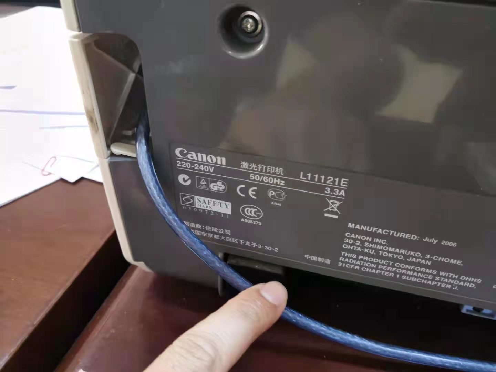

 
 # 如何在UOS系统中安装佳能L11121E打印机



## 前提条件

1. UOS操作系统架构及版本：专业版1031
1. 计算机架构：Intel X86
1. L11121E打印机驱动：[CAPT Printer Driver for Linux V2.71
](https://sg.canon/en/support/0100459601)

## 操作步骤

1. 下载并安装打印机驱动。

```
tar -xvf linux-capt-drv-v271-uken.tar.gz
cd linux-capt-drv-v271-uken/64-bit_Driver/Debian
sudo dpkg -i cndrvcups-common_3.21-1_amd64.deb
sudo dpkg -i cndrvcups-capt_2.71-1_amd64.deb
udo apt-get -f install
```
2. 运行ldd命令检查是否缺少依赖库名。

```
ldd /usr/bin/captfilter
linux-gate.so.1 (0xf779e000)
libpopt.so.0 => not found
libc.so.6 => /lib32/libc.so.6 (0xf75c4000)
/lib/ld-linux.so.2 (0x5662e000)
```
注意：若显示 not found，运行下面的命令安装依赖库。

```azurepowershell
sudo apt install libpopt0:i386
```

3. 电脑插入打印机USB，检查计算机是否是识别设备。

```azurepowershell
ls /dev/usb
```
注意：如果USB连接正常，会返回lp0或lp1。如果没有显示，尝试拔掉USB数据线在连接一次。

4. 运行lpadmin命令安装打印机。
```
udo /usr/sbin/lpadmin -p L11121E -m CNCUPSLBP2900CAPTK.ppd -v ccp://localhost:59687 -E
```

5. 运行ccpdadmin命令配置打印机端口。
```
sudo /usr/sbin/ccpdadmin -p L11121E -o /dev/usb/lp0
```

注意：与usb显示的端口保持一致。

6. 重启ccpd服务。
```
sudo service ccpd restart
sudo service ccpd status
```
7. 测试打印。

```
lpr -P printer file1.pdf
```